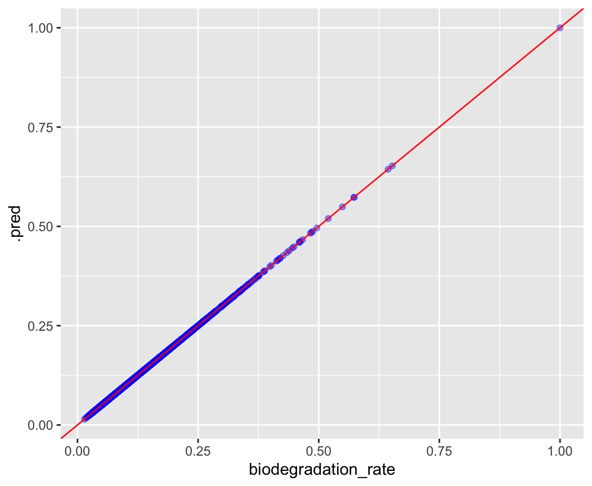
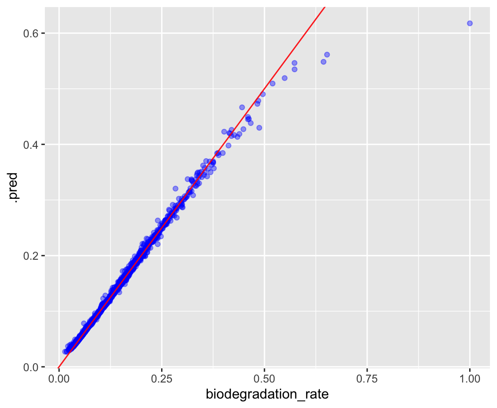

# Solution to Bioremediation Exercise


## Data understanding

First we load the data with:

```R
biodegradation_data = readRDS(url("https://raw.githubusercontent.com/lescai-teaching/class-bigdata-2023/main/L18_modelling_exercises/L18_dataset_biodegradation_data.rds"))
```

Once the data are in, the first step is to inspect the dataset:

```R
biodegradation_data
```

To understand what type of variables we are dealing with.

We could plot all combinations of variables with:

```R
ggpairs(biodegradation_data)
```

But the plot is rather complicated and unhelpful in this case, due to the distributions of the variables and the large number of items in the plot.

Looking at the names of the variables in the dataset:

```R
names(biodegradation_data)
```

in the context of the description of the dataset, one might assume that the variable *biodegradation_rate* could be considered the predictor.

It is a continuous variable, and therefore the model is a predictive regression model.


## Modelling

### Data Spending

The first step is therefore the split of data into training and testing, as follows:

```R
biodegradation_data_split = initial_split(biodegradation_data, prop = 0.75)
biodegradation_data_training = training(biodegradation_data_split)
biodegradation_data_testing = testing(biodegradation_data_split)
```

### Linear Regression Model

We don't know if the predictor have a linear relationship with the outcome, but we will start with a linear model before moving further.

We create the model

```R
lm_model <-
  linear_reg() %>% 
  set_engine("lm")
```

Then we specify the recipe, where we run a normalisation:

```R
biodegradation_recipe <- 
  recipe(biodegradation_rate ~ ., 
         data = biodegradation_data_training) %>% 
  step_normalize(all_predictors())
```

And using those two we prepare the workflow specification:

```R
biodegradation_lm_workflow <- workflow() %>% 
  add_model(lm_model) %>% 
  add_recipe(biodegradation_recipe)
```

We fit the model:

```R
biodegradation_lm_wf_fit <- fit(
  biodegradation_lm_workflow,
  biodegradation_data_training
)
```

And we can this way combine the predictions with the original data:

```R
biodegradation_lm_wf_prediction = biodegradation_lm_wf_fit %>%
  predict(biodegradation_data_testing) %>%
  bind_cols(biodegradation_data_testing)
```

which allows us to make the plot and inspect visually the results of the prediction:

```R
biodegradation_lm_wf_prediction %>%
  ggplot(aes(x=biodegradation_rate, y=.pred))+
  geom_point(alpha = 0.4, colour = "blue")+
  geom_abline(colour = "red", alpha = 0.9)
```




We can also visualise the summary metrics with

```R
biodegradation_lm_wf_prediction %>% 
  metrics(truth = biodegradation_rate, estimate = .pred)

# A tibble: 3 × 3
  .metric .estimator .estimate
  <chr>   <chr>          <dbl>
1 rmse    standard    4.29e-16
2 rsq     standard    1   e+ 0
3 mae     standard    4.07e-16
```


### Random Forest model

In order to test a random forest model we first create the specs

```R

rf_model <- rand_forest(
  trees = 1000
  ) %>% 
  set_mode("regression") %>% 
  set_engine("ranger")
```

Then the recipe as above

```R
biodegradation_rf_recipe <- 
  recipe(as.formula(paste0("biodegradation_rate ~ ", 
                           paste0(
                             names(biodegradation_data_training)[!names(biodegradation_data_training) %in% c("biodegradation_rate")],
                             collapse = " + "
                             )
                           )
                    ), 
         data = biodegradation_data_training) %>% 
  step_normalize(all_predictors())
```

Finally the workflow

```R

biodegradation_rf_workflow <- workflow() %>% 
  add_model(rf_model) %>% 
  add_recipe(biodegradation_rf_recipe)
```

and we fit as usual:

```R

biodegradation_rf_wf_fit <- fit(
  biodegradation_rf_workflow,
  biodegradation_data_training
)
```

We can then inspect the prediction in the same way:

```R

biodegradation_rf_wf_prediction = biodegradation_rf_wf_fit %>%
  predict(biodegradation_data_testing) %>%
  bind_cols(biodegradation_data_testing)

biodegradation_rf_wf_prediction %>%
  ggplot(aes(x=biodegradation_rate, y=.pred))+
  geom_point(alpha = 0.4, colour = "blue")+
  geom_abline(colour = "red", alpha = 0.9)
```


Here we can already see the prediction seems to be a little off on the higher values.

If we compare the metrics:

```R
biodegradation_rf_wf_prediction %>% 
  metrics(truth = biodegradation_rate, estimate = .pred)

# A tibble: 3 × 3
  .metric .estimator .estimate
  <chr>   <chr>          <dbl>
1 rmse    standard     0.00896
2 rsq     standard     0.987  
3 mae     standard     0.00226
```


it is indeed very good but not as much as the linear model.
